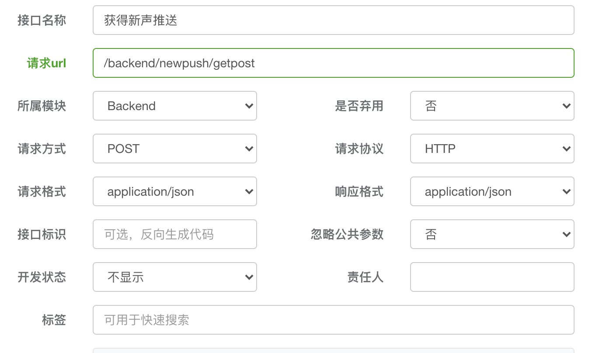
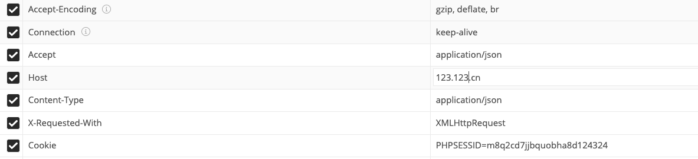
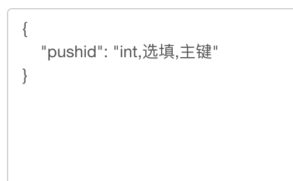
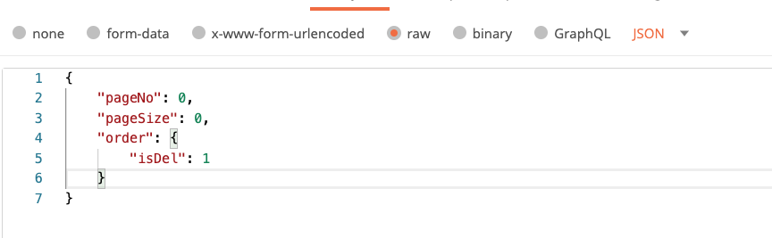

# use_postman
1. 了解啥是postman及其基础的使用方法。（附链接，下面讲解一些具体的运用）
+ [博客链接](https://www.jianshu.com/p/ad7295d7bb41)
2. 根据后端提供的接口文档对postman进行配置。
+ 请求头配置

+ 请求方式啥的自己看清楚，url建议复制避免出错。

+ 然后在Headers中进行配置，记住Host要配置，以及文档是否需要cookie，有些接口需要传入登录后的数据才能访问。

+ 最后就是需要传入的数据，在body中进行配置。

+ 如果是json格式，直接选择raw并选择json格式传参。

