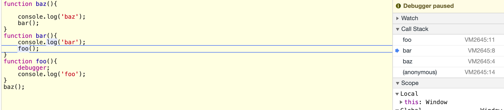

## this的理解
### 了解this是的前提
+ this既不指向函数自身也不指向词法作用域。
+ 一旦尝试this与词法作用域混用时一定是错误的。
+ this只在调用时才会绑定
### 了解什么是调用位置，确定this什么时候绑定。
+ 调用位置就是函数在代码中被调用的 位置(而不是声明的位置)，调用位置就在当前正在执行的函数的前一个调用中。 它决定了 this 的绑定。
    - 例如在下图实例中，在foo函数添加debugger；语句，可以看到他的调用位置在bar中
    
    - 你可以在javascript调试工具中给 函数的 第一行代码设置一个断点，或者直接在第一行代码之前插入一条 debugger; 语句。运行代码时，调试器会在那个位置暂停，同时会展示当前位置的函数 调用列表，这就是你的调用栈。因此，如果你想要分析 this 的绑定，使用开 发者工具得到调用栈，然后找到栈中第二个元素，这就是真正的调用位置。
### 绑定规则
+ 默认绑定
    - 直接使用不带任何修饰的函数引用进行调用的，因此只能使用 默认绑定，无法应用其他规则。
    - 例如
    ```
    function baz() {
        console.log(this.a);
    }
    var a = 1;
    baz();//1
    ```
    - 如果使用严格模式(strict mode)，那么全局对象将无法使用默认绑定，因此 this 会绑定 到 undefined:
+ 隐式绑定
    - 当函数引 用有上下文对象时，隐式绑定规则会把函数调用中的 this 绑定到这个上下文对象。因为调 用 foo() 时 this 被绑定到 obj，因此 this.a 和 obj.a 是一样的。
    ```
    function foo() {
        console.log(this.a);
    }
    var obj = {
        a: 2,
        foo: foo
    };
    obj.foo(); // 2
    ```
+ 显示绑定
    - 可以使用 call(..) 和 apply(..) 方法，它们的第一个参数是一个对象，它们会把这个对象绑定到 this，接着在调用函数时指定这个 this。因为你可以直接指定 this 的绑定对象，因此我 们称之为显式绑定。
    - 硬绑定
        - 使用bind方法，绑定后的this无法再修改。
+ new绑定
    - this指向实例
    - new的本质
    1. 创建(或者说构造)一个全新的对象。
    2. 这个新对象会被执行[[原型]]连接。
    3. 这个新对象会绑定到函数调用的this。
    4. 如果函数没有返回其他对象，那么new表达式中的函数调用会自动返回这个新对象。        